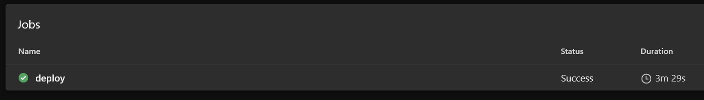

# DigitRE DEV-ML-OPS Getting Started

## Sommaire

- [Azure Devops ]()
  - [Azure Repos]()
    - [Digitre-estimation-engine]()
    - [Devops-MLops]()
  - [Azure Pipelines]()
    - [[ML]-[Extract-Prepare]]()
      - [Functionality]()
      - [Triggers]()
      - [Approvals]()
    - [[ML]-Train-Evaluate-Register]()
      - [Functionality]()
      - [Triggers]()
      - [Approvals]()
    - [[DEV]-Build_and_Deploy]()
      - [Functionality]()
      - [Triggers]()
      - [Approvals]()
    - [[Dev]-Delete-After-24Hours]()
      - [Functionality]()
      - [Triggers]()
      - [Approvals]()
    - [[QA]-Deploy]()
      - [Functionality]()
      - [Triggers]()
      - [Approvals]()
    - [[Manual]-[Custom-QA]-Deploy]()
      - [Functionality]()
      - [Triggers]()
      - [Approvals]()
    - [[Manual]-[Prod]-deployment]()
      - [Functionality]()
      - [Triggers]()
      - [Approvals]()
  - [Azure Dashboard]()

## 1. Azure Devops

### Azure Repos

#### Digitre-estimation-engine

#### Devops-MLops

### Azure Pipelines

This Architecture shows How Azure Pipelines are Working Together
includes :

- Workflow
- Triggers
- Approvals

#### **[ML]-[Extract-Prepare]:**

##### **Functionality**

    [ML]-[Extract-Prepare] :
    - Check if AzureML Compute are created if not creates new
    - publish Azure ML Pipeline[more about Azure ML Pipeline](https://link.com)
    - once the pipeline is Published it Runs it remotely

##### **Triggers**

    [ML]-[Extract-Prepare] Pipeline Can be triggered :
     - Manually From Azure Devops
     - Automatically By a commit to the branch develop in Digitre-estimation-engine Repo

##### **Approvals**

    [ML]-[Extract-Prepare] Has no Approvals

#### **[ML]-Train-Evaluate-Register :**

##### **Functionality**

[ML]-Train-Evaluate-Register : 

* Publish_AML_Pipeline
  * Adding Repo
  * Publish Training Pipeline
* Trigger_AML_Pipeline
  * Get Pipeline ID for execution
  * Trigger ML Training Pipeline
  * Publish artifact if new model was registered
* Delete AML Compute
  * Delete Compute

    

##### **Triggers**

[ML]-Train-Evaluate-Register Pipeline Can be triggered :

---

**Approvals**

    [ML]-Train-Evaluate-Register Has no Approvals

#### **[DEV]-Build_and_Deploy:**

##### **Functionality**

[DEV]-Build_and_Deploy :

* Build and push Model to ACR
  * Download Pipeline Artifacts
  * Parse Json for Model Name and Version
  * Install AML CLI
  * Download model
  * Build and Push model
  * Deploy to Dev ACI
    * Check If ACI Exist
    * Cancel pipeline delete
    * Delete + Re-Deploy **OR** Deploy The New Dev-ACI

      

---

**Triggers**

   [DEV]-Build_and_Deploy  Pipeline Can be triggered :

##### **Approvals**

    [DEV]-Build_and_Deploy Has no Approvals

#### **[Dev]-Delete-After-24Hours:**

##### **Functionality**

 [Dev]-Delete-After-24Hours : 

* Send deletion notification and Delete ACI After 24 hours
  * send notification for dev aci deletion - sendgrid
  * Waiting 24 Hours
  * Delete ACI

    

##### **Triggers**

    [Dev]-Delete-After-24Hours: Pipeline Can be triggered :

##### **Approvals**

    [Dev]-Delete-After-24Hours Has no Approvals

#### **[QA]-Deploy:**

##### **Functionality**

 [QA]-Deploy :

* Check If Build Is Already Deployed
* Delete Existing And Re-Deploy  ***OR*  **Deploy to QA

##### **Triggers**

    [QA]-Deploy Pipeline Can be triggered :

##### **Approvals**

    [QA]-Deploy Has no Approvals

#### **[Manual]-[Custom-QA]-Deploy:**

##### **Functionality**

  [Manual]-[Custom-QA]-Deploy :

* Check If Build Is Already Deployed
* Delete QA-ACI + Deploy New Version *OR* Deploy QA-ACI

  

##### **Triggers**

    [Manual]-[Custom-QA]-Deploy Pipeline Can be triggered :
     - Manually From Azure Devops
     - Automatically By a commit to the branch develop in Digitre-estimation-engine Repo

##### **Approvals**

    [Manual]-[Custom-QA]-Deploy Has no Approvals

#### **[Manual]-[Prod]-deployment:**

##### **Functionality**

 [Manual]-[Prod]-deployment :

* Deploy Engine Helm application
* Create if Deployment not exist
* Update if Deployment already exist

  

##### **Triggers**

    [Manual]-[Prod]-deployment Pipeline Can be triggered :

    - Manually From Azure Devops

##### **Approvals**

    [Manual]-[Prod]-deployment Has no Approvals

### Azure Dashboard

### **Repo Details**

You can find the details of the code and scripts in the repository [here ](google.com)
