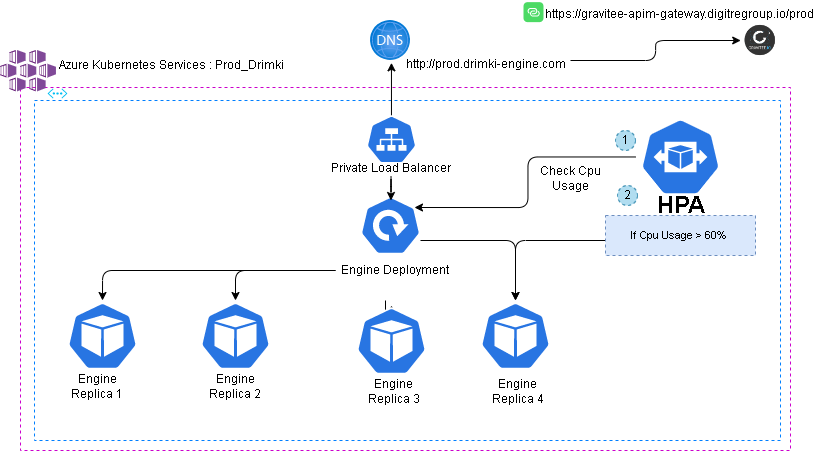

## Deploy AKS Using Helm Chart

- [About Helm Chart](#about-helm-chart)
- [Helm Chart Structure](#helm-chart-structure)
- [Architecture](#kubernetes-architecture-)
- [Deployment](#engine-deployment)
    - [rolling-updates](#rolling-updates)
    - [AutoScaling](#auto-scaling)
- [Configuration](#configuration)
- [Usage](#usage)

## About Helm Chart

Helm Charts are a collection of files that describe a related set of Kubernetes resources. A chart can be used to describe a simple pod of a complex application. This chart deploys the DigitRE Estimation Engine API Image on AKS.

```
Note  : This is Just an explination of the chart 
        the Azure Devops Pipeline Deploys the image automatically
        this is just an overview of the chart
```

## Helm Chart Structure

Directory structure for helm chart files :

```bash
├── .helmignore                   <- Files to be ignored by helm package.
├── Chart.yaml                    <- The Chart.yaml file describes the package.
├── values.yaml                   <- The default configuration values for this chart.
├── templates                     <- A directory of templates that, when combined with values, will generate valid Kubernetes manifest files.
    ├── deployment.yaml           <- The deployment definition.
    ├── service.yaml              <- The service definition.
    ├── hpa.yaml                  <- The horizontal pod autoscaler definition.
    ├── _helpers.tpl              <- Template helpers that provide functions for use in other templates.
```
## Kubernetes Architecture : 

For the production environment, we chose Azure kubernetes Services (AKS) because it simplifies the deployment and management of our microservices-based architecture.
AKS also streamlines horizontal scaling, auto-scaling, auto-repair, load balancing, continuous deployment and rolling updates.
AKS is deployed on the Virtual Network : Vnet-Digi which is paired with Gravitee Vnet with 3 pods running the engine image and an internal LB (Load Balancer) with the dns record http://prod.drimki-engine.com/ which is added as a Gravitee api with the public url https://gravitee-apim-gateway.digitregroup.io/prod


## Engine Deployment 

A Kubernetes Deployment tells Kubernetes how to create or modify instances of the pods that hold a containerized application

```yaml
apiVersion: apps/v1
kind: Deployment
metadata:
  name: engine # name of the deployment
spec:
  replicas: {{ .Values.replicaCount }}
  strategy:
    rollingUpdate:
      maxSurge: 1        # <2>
      maxUnavailable: 0   # <3>
    type: RollingUpdate   # <1>
  selector:
    matchLabels:
      app: engine
  template:
    metadata:
      labels:
        app: engine
    spec:
      containers:
      - name: engine
        image: "{{ .Values.image.repository }}:{{ .Values.image.tag | default .Chart.AppVersion }}" # Engine Image
        resources:
          requests:
            cpu: 250m
          limits:
            cpu: 500m
        ports:
          - containerPort: 80
        readinessProbe:
          initialDelaySeconds: 5   #<4>
          periodSeconds: 2          #<5>
          httpGet:
            path: /                 #<2>
            port: 80              #<3>
        imagePullPolicy: IfNotPresent
      imagePullSecrets: 
      - name: acr-secret     # secret containing ACR Credentials to pull the engine image
```
#### Rolling Updates 
Rolling Update Inference Image
To keep the inference image always up and running, we propose the Rolling Update strategy that allows the Kubernetes system to be updated without service interruption.
With the parameters: 
- maxunavailable = 0
- maxsurge = 1 
Kubernetes ensures that there is no downtime during the rollover by keeping version 1 pods alive until the new version is ready to serve.

```yaml
  strategy:
    rollingUpdate:
      maxSurge: 1        # <2>
      maxUnavailable: 0   # <3>
    type: RollingUpdate   # <1>
```

A readiness probe indicates whether applications running in a container are ready to receive traffic. If so, Services in Kubernetes can send traffic to the pod, and if not, the endpoint controller removes the pod from all services

```yaml
   readinessProbe:
     initialDelaySeconds: 5   #<4>
     periodSeconds: 2          #<5>
     httpGet:
       path: /                 #<2>
       port: 80              #<3>
```
## Auto Scaling

- Horizontal Pod Autoscaler (HPA) is used to scale the number of pods in a replication controller, deployment, replica set, or stateful set based on observed CPU utilization (or, with custom metrics support, on some other application-provided metrics).
- Horizontal Pod Autoscaler is configured to scale the number of pods based on the CPU utilization of the pods.

  

#### The Horizontal pod Autoscaler 

```yaml
apiVersion: autoscaling/v1
kind: HorizontalPodAutoscaler
metadata:
  name: autoscaling
spec:
  maxReplicas: 100 # define max replica count
  minReplicas: 3  # define min replica count
  scaleTargetRef: # refrencing the image deployment
    apiVersion: apps/v1
    kind: Deployment
    name: engine  # Apply to engine deployment
  targetCPUUtilizationPercentage: 60 # target CPU utilizations
```

Parameters : 

| Parameter                                      | Description                                | value                                   |
| ---------------------------------------------- | ------------------------------------------ | ----------------------------------------|
| `maxReplicas`                                  | the max amount of replicas possible        | `100`             |
| `minReplicas`                                  | the min amount of replicas (default)       | `3`       |
| `targetCPUUtilizationPercentage`               | when  **cpu utilzation** > **cpu target** the **hpa** will automatically scale up and when the **cpu usage** < **cpu target** the hpa will automatically scale down           | `60` |


## Values.yml

## Configuration

The following table lists the configurable parameters of the DigitRE API chart and their default values.

| Parameter                                      | Description                          | Default          |
| ---------------------------------------------- | ------------------------------------ | ---------------- |
| `replicaCount`                               | Number of replicas to run            | `3`            |
| `image.repository`                           | Name of the image                    | `engine`       |
| `image.tag`                                  | Tag of the image                     | `latest`       |
| `image.pullPolicy`                           | Pull policy for the image            | `ifNotPresent` |
| `service.type`                               | Type of the service                  | `LoadBalancer` |
| `service.port`                               | Port of the service                  | `80`           |
| `resources`                                  | Resources to be allocated to the pod | `{}`           |
| `autoscaling.enabled`                        | Enable autoscaling                   | `false`        |
| `autoscaling.minReplicas`                    | Minimum replicas to scale            | 3                |
| `autoscaling.maxReplicas`                    | Maximum replicas to scale            | `100`          |
| `autoscaling.targetCPUUtilizationPercentage` | CPU utilization to scale             | `50`           |
| `nodeSelector`                               | Node selector                        | `{}`           |
| `tolerations`                                | Tolerations                          | `[]`           |
| `affinity`                                   | Affinity                             | `{}`           |

---

## Usage

> **Tip**: helm and kubectl commands

```bash
# To deploy a specifig version
helm install engine helm-prod-aks --namespace engine  --set image.tag=<TAG>

# update if deployment already exist
helm upgrade engine helm-prod-aks --namespace engine --set image.tag=<TAG>


# To list the releases:
$ helm list -n engine

# Get the URL of the API
kubectl get ingress -n engine

# watch the autoscaler
watch kubectl get hpa -A

# view all pod  
kubectl get pods -n engine

# view nodes  
kubectl get nodes

# check deployment services 
kubectl get svc -n engine

```
